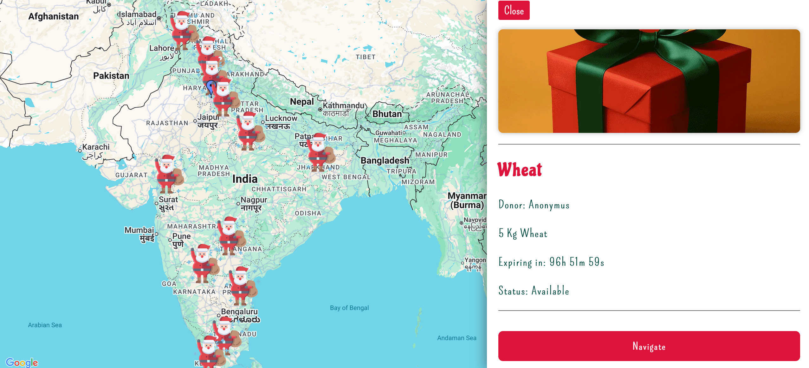
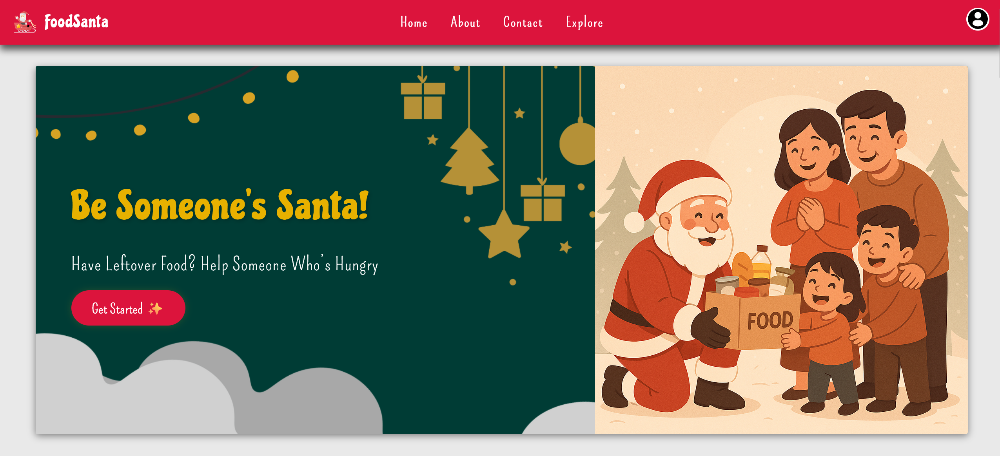
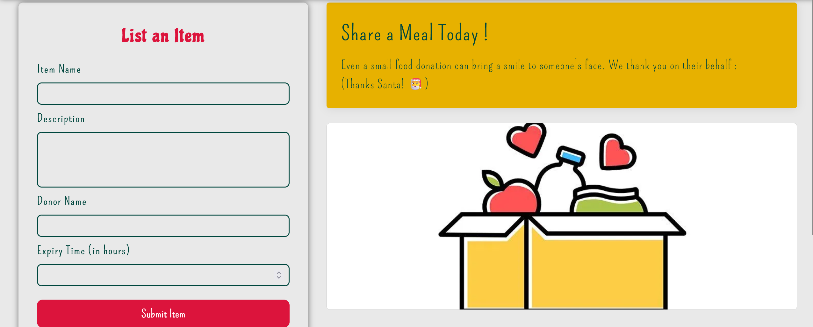

# 📦 FoodSanta

**FoodSanta** is a full-stack React web application that aims to solve the problem of Zero Hunger (UN SDG Goal 2) and Food wastage by enabling users to list, discover, and share food items in real-time using Firebase and Google Maps. It offers a personalized account experience, secure authentication, and responsive UI with a festive-inspired design.

The Site Is Live At : https://foodsanta-in.web.app/

---

## 🚀 Features

- 🔐 **Firebase Authentication** (Email/Password + Google Login)
- 🗺️ **Real-time Map View** using Google Maps API
- 📍 **Geo-based Listings** with live expiry countdown
- 🎄 **Custom Christmas-Themed UI** (Pompiere & Chicle fonts)
- ✅ **Create / Edit / Delete Listings**
- 👤 **My Account Dashboard** with secure password update
- 📧 **Forgot Password** recovery option
- ☁️ **Firebase Realtime Database** for fast, scalable storage
- 💬 **Modal and Toast Notifications** for user feedback
- 📱 **Fully Responsive** down to 250px width

---

## 🛠️ Tech Stack

- **Frontend**: React.js, Framer Motion, Custom CSS
- **Backend**: Firebase Realtime Database
- **Authentication**: Firebase Auth
- **Maps**: Google Maps JavaScript API
- **Deployment**: Firebase Hosting (optional)

---

## 🔧 Folder Structure

```
FoodSanta/
├── public/
├── src/
│   ├── Components/         # Reusable UI components (Navbar, Footer, etc.)
│   ├── Context/            # Auth context for global user state
│   ├── Pages/              # Page-level components (Login, Signup, Discover, MyAccount)
│   ├── style/              # Custom CSS files
│   ├── Assets/             # Fonts, images, and logos
│   └── App.js
├── .env                   # API keys (Google Maps, Firebase)
└── README.md
```

---

## 🔑 Environment Variables (`.env`)

Create a `.env` file in the root with:

```
REACT_APP_FIREBASE_API_KEY=your_firebase_key
REACT_APP_FIREBASE_AUTH_DOMAIN=your_firebase_auth_domain
REACT_APP_FIREBASE_DB_URL=your_firebase_db_url
REACT_APP_FIREBASE_PROJECT_ID=your_project_id
REACT_APP_FIREBASE_STORAGE_BUCKET=your_storage_bucket
REACT_APP_FIREBASE_MESSAGING_SENDER_ID=your_sender_id
REACT_APP_FIREBASE_APP_ID=your_app_id

REACT_APP_NEXT_PUBLIC_GOOGLE_MAPS_API_KEY=your_google_maps_key
```

---

## 🧪 Local Development

```bash
# Install dependencies
npm install

# Start development server
npm start
```

---

## ✅ Firebase Setup

1. Go to [Firebase Console](https://console.firebase.google.com/)
2. Enable:
   - Authentication → Email/Password & Google
   - Realtime Database
3. Add your credentials to `.env`
4. Set database rules for open access (for testing):

```json
{
  "rules": {
    ".read": "true",
    ".write": "true"
  }
}
```

---

## 📌 Future Improvements

- AI-powered suggestions for food redistribution
- Expiry alert via email/SMS
- Admin moderation dashboard
- Convert to Next.js with TypeScript

---

## 📸 Screenshots
- HomePage


- Functions


- Items Listing page


- Map showing available food items

---

## 📄 License

This project is licensed under the MIT License.